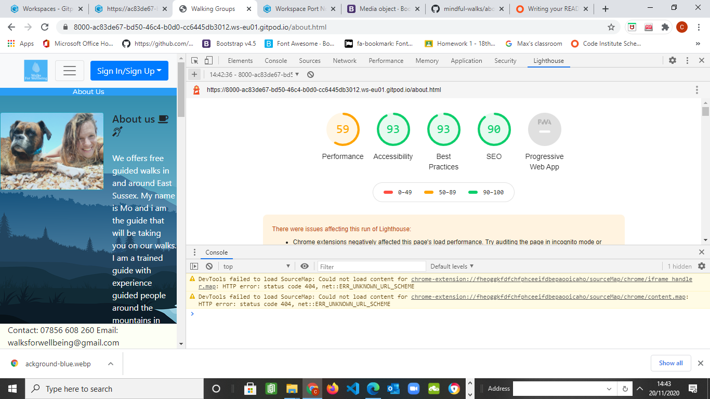
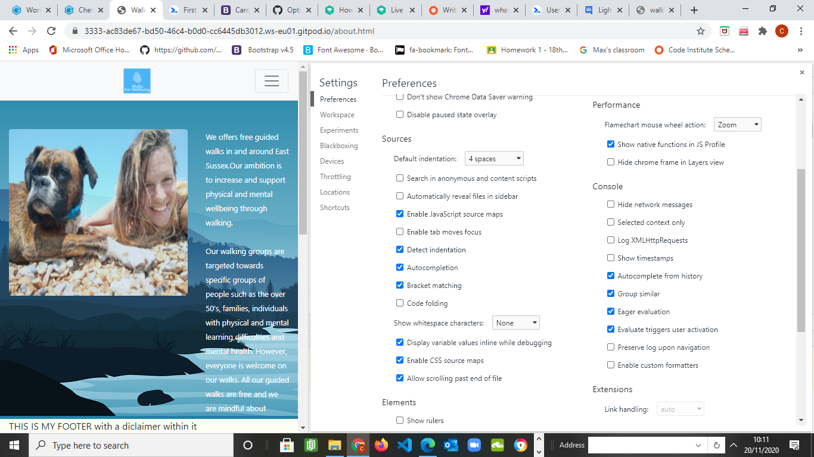

# Walks For Wellbeing 

>## *Introduction*

Walks For Wellbeing is a website providing free guided walks in and around East Sussex to specific groups of people in order to promote physical and mental wellbeing. The groups this website is targeted to are over 50's, people who suffer from or support mental health, special needs or learning/physical difficulties and families. The website offers a landing page with an option to input their name and email to our 'list' in order to receive a timetable and newsletter of our walks and future plans to expand. The title sits on top of a hero image that covers the page.

At the top of the front page there are navigation links to furthur pages included in the website, alongside social media links to Facebook and Instagram that open in a new tab.

Below the title and the hero image section there is a carousel showcasing the groups that we support through a rolling gallery of pictures with text explaining the areas we walk in. There are three pages in total including the landing page, an about page and a walking information page.

>## *Goals*
 

The goal for this website is to ifluence individuals and vunerable groups of people to increase their physical activity in order to support their physial and mental wellbeing. The walks are all local and guided by a trained guide who has a number of years experience guiding people through mountain ranges in Spain.

Each walk is free to enable access to everyone.

># Groups
 

>### *Over 50's*

Research suggest that many over 50's are lonely and often feel isolated from the world. This website wants to tackle that through social walks. The end goal for this group is to encourage new friendships and physical activity. Each walk for this group is carefully considered so that socialising is at the forefront of our thoughts, to ensure that this is acheived we ensure that each walk has an opportunity to stop for a cup of tea or a slice of cake to allow the opportunity to talk.
 
>### *Mental Health*

Mental illness has dramatically increased in people of all ages thoughout 2020, demonstrating how vulnerable people's mental health can be. Increasing your physical activity has been proven to be effective in supporting better mental health. This walking group hopes to provide an environment for people to talk about their mental health with like minded people, whilst getting vital physical activity. This group walk is designed to tackle both.

>### *Learning/Physical difficulties*

Individuals who suffer from learning or phyical difficulties often do not not have access to support in getting vital physical activity. Care homes and support groups are often overwelmed. Finding activities to do that support physical wellbeing can be hard. This walking group is designed to offer an option for individuals and groups that suffer from learning or physical difficulties to get vital physical activity. Each walk is mindful of terrain and duration to support this groups needs.

>### *Families* 

This walking group is targeted towards families in order to offer something to do with the kids that increases their physical wellbeing whilst being free. As more families struggle with their finances and have to compromise on days out with the family, this walk offers a place to take the kids and meet other families whilst exploring and learning about our countryside.

>### *Customer Goals* 

* Increaseing physical activity

* Increasing wellbeing 

* Visiting the countryside and exploring areas in East Sussex

* Meeting new people 

>### *User Stories* 

* I am over 50 and often find myself isolated and want to meet new people whilst increasing my physical activity.  

* As someone who suffers from mental health, i want to increase my physical activity to support my mental wellbeing in my local area with group of people that understand mental health or have experience with managing their own. I want to find a website that offers clear information on how to attend a walk like this.

* As a someone who work with individuals with special needs, i want to explore more activities i can take them on that consider their needs.I want to find a website that offers clear information on how to attend a walk like this.

* As a parent i want to find an activity i can take my children to that promotes physical health, is free and local to me.I want to find a website that offers clear information on how to attend a walk like this.

>### *Colour Pallete used*  

* #eeeeee

* #ffffff

* #004e7c

* #f4f2f3

The colours used for this webasite are intended to promote a feeling of welbeing. Designs assoiated with colour are carefully considered to be support a un-complicated experience for the user in order to allow smooth navigation and a feeling of welcome. 

>### *Fonts* 

* Montserrat', sans-serif;
* Marck Script', cursive;

>### *Design* 

The design of this website is carfully considered in conjunction with user stories to allow each user to understand what the service offers and how it will benefit them. 

The layout on the front page allows users to identify what the website is for through a decriptive title along with a carousel below it identifying the locations the walks take place at. Included below the carousel shows some facts regarding information on how walking can help each specific group.

The page is covered by a hero image to highlight the header at first glance and allows the user to consider the carousel secondly. The carousel has images included it that showcase visually to the user the range of people this website is targeted too.

The second page is focused on providing the user with some information on who the company is, our goals and mission and expertise in providing guided walks. 

The final page showcases a list of walking times and locations below an image of the specific group the walk is for. Beside that on the right is some text explaining who the walking group is for and what the goal is for people who attend. This is designed in this way to allow users to quickly navigate to the walking group that is associated with their needs and gather information on times and locations easily.

>### *Images*

#### All images that were used for this project were free or personal images 

Included are images of people walking from different groups and ladscape pictures 

>### *Videos*

Within the third page are links to videos in a dropdown menu that showcase the area the walk is being held.

>### *Technologies* 

* HTML
* CSS
* Javascript
* Bootstrap

>### *Tools* 

* Gitpod 
* Git 
* Stackoverflow 
* Code Camp
* Figma 
* W3 CSS Validator 
* Chrome Dev tools 
* Freelogodesign.org
* Font Awesome Icon
* Google Fonts 

>### *Gitpod*

Commands -
 
 * git add
 * git commit -m 'message'
 * git push origin master
 * git status 
 * python -m http.server 

 >### *Github* 

GitHub has been used for this project to hold the repository associated with this project, to launch the project please follow the steps below deployment.

>### *Testing*

 Extensive testing was done throughout each page:

* Front page test were done on navigation links at the top of the page. Tests show that menu links link to the correct page in the website and social media icons open in a new page. The dropdown menu opens as it should to the left of the webpage.

* Front page: The carousel is moving through images as it should 

* Front page: The background image is responsive on different devices 

* Both html and css passes through the w3 validator 

* Second page: All navigation links open as they should do within the navigation background

* Content is responsive on mobile level

* Third page: All navigation links work and open in a new tab, changes were made to certain aspects of the code through the validation process as it showed multiple list wrapped together did not pass, this was changed by wrapping each one in a menu tag.

Tests were done through Lighthouse with a picture to show the result below:

Changes were made to the source settings to allow a better performance 

  

>### **Ux and User Stories**

Each user story has been tried and tested to ensure user experience and clear navigation around the website was carefully considered and easy. 

1. *Over 50's*
* Upon reaching the first page of the website, this user can see the first title on the page that explains what our walks are promoting. At the top of the page are links to access different pages such as information on our walking guide and walking times, dates and locations. This allows the user to quickly access the information they are looking for. 

2. *Mental Health*
* This user is looking to find a website that offers a service that will increase their physical activity to support their mental health. Facing the front page, this user can see the title explaining what our walks are their to support, allowing them to understand that we support physical activity and mental wellbeing. Below is a carousel where they can see a variety of people who attend our walks. Below the carousel shows some facts relating to this user that encourages the need for physical activity to increase mental wellbeing. The easy navigation found at the top of the page allows this user to find the right page that offers the information they need such as their walking group, the location they are in and links to videos showcasing the area the walk will be. 

3. *Physical or Learning difficulties* 
* This user could be an individual who supports someone with physical or learning difficulties or someone who has learning or physical difficulties and wants to access a website that offers a service to support this. The design of the website make it easy to read with clear navigations to desired information. Within the walking information page, the user can find a video showcasing the ease of walk and accessabiltiy.

4. *Family Group* 
* As a user with a family, the first page of the website clearly identifies the service is to increase one's health. The carousel shows families walking with their child to ensure the user understands this service is for them. Easy access to links to social media allow this user to access further information about our services. Easy access to information on the about page, explaining the intent for increasing physical activity through walking. Navigating through to the walking group page allows this user to read more information on our family walks.

The pallete of colours used offers a calming journey throughout navigation 

Imformation about each walk, how to access futher information on dates and times easy to navigate.

>### **Figma**

The link provided goes to my Figma showcasing my wireframe.

https://www.figma.com/file/RtUGdfELA23K4YYXDf7jpN/Untitled?node-id=0%3A1 

>### **Guidence and Support**

* Seun Owonikoko (my mentor)
* Tutor Support (CI online webchat)
 
  
>### **Deployment**

* Log into GitHub.
* Go to repositories choose mindful-walks.
* Go to settings.
* Go down to GitHub Pages.
* Click on master branch.
* Go down to GitHub Pages and click on the provided link.

